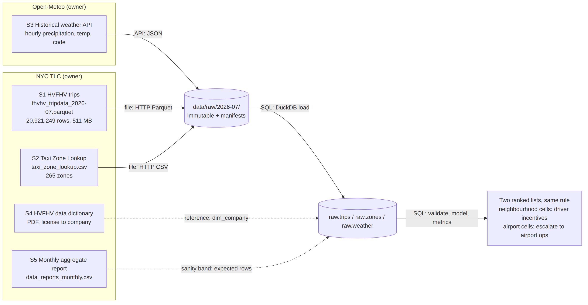
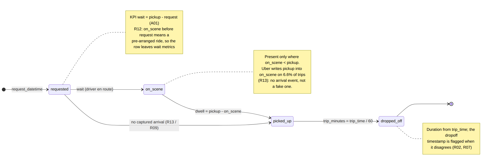
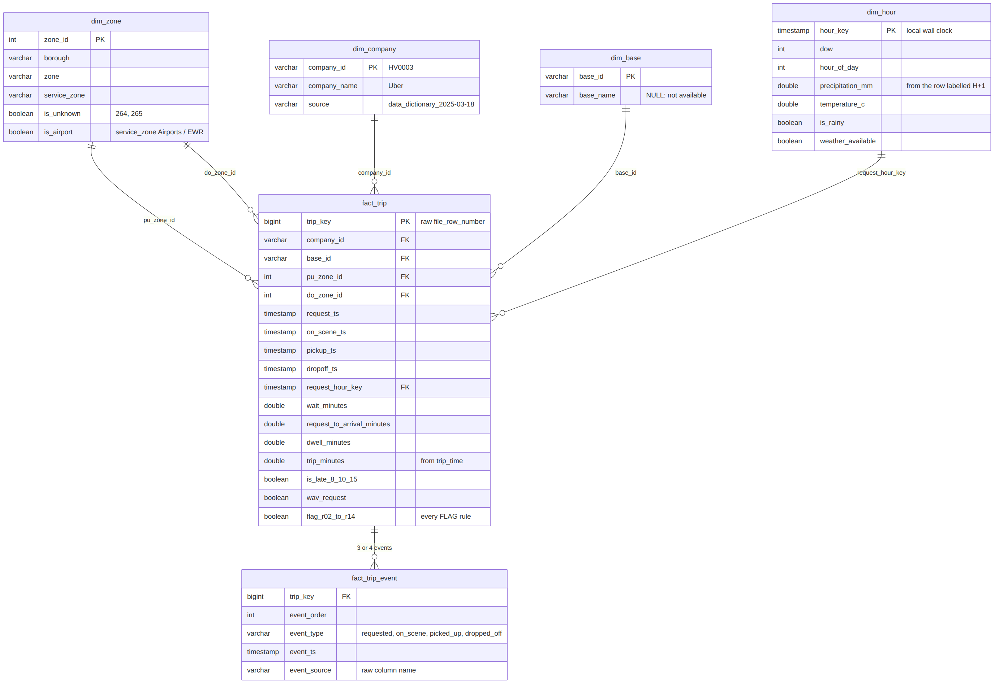
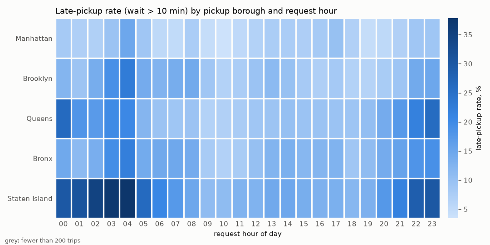
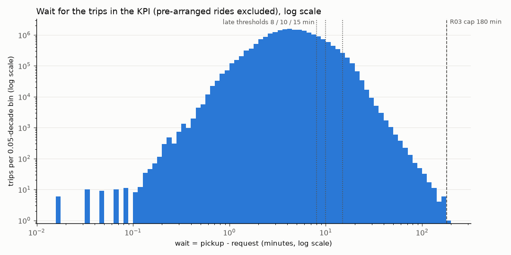

# Late Pickup Radar

A monthly, repeatable pipeline from NYC TLC high-volume FHV (ride-hail) trip records to one
decision: **which zone x hour-of-week cells get driver-supply incentives next month.**

## Results at a glance (2026-07, 20,921,249 trips)

| | |
|---|---|
| **Late-pickup rate** (wait > 10 min) | **10.02%** (17.53% at 8 min, 2.69% at 15 min) |
| p90 wait | 10.02 min |
| Trusted-row share (not quarantined) | 99.998% (376 rows quarantined) |
| Wait-eligible share (rows in the KPI) | 98.245% (pre-arranged rides excluded) |
| Dwell coverage (arrival captured) | 95.156% (Uber 93.40%, Lyft 99.86%) |
| Rain effect (98 wet hours of 744) | +1.1 points within the same hour of day: a weak lever |
| **Top neighbourhood cell** | **Williamsburg (North Side), Sat 23:00: 33.5% late, n = 3,358, 788 excess late trips** |
| Top airport cell (escalate, not incentivise) | LaGuardia, Wed 23:00: 61.5% late, request -> arrival 10.5 vs 4.5 min |

Full evidence: [`outputs/2026-07/evidence.md`](outputs/2026-07/evidence.md) (one-page view:
[`evidence.html`](outputs/2026-07/evidence.html)). Spec: [`docs/PRD.md`](docs/PRD.md).

---

## 1. Problem

The operations team of a large NYC ride-hail base hears that riders wait too long for pickup.
Leadership wants to know where and when wait piles up, and whether driver incentives in specific
zones are worth it next month. This pipeline produces, every month, a ranked list of zone x
hour-of-week cells for those incentives, with the data quality behind every number.

## 2. Users / stakeholders

- **Ops lead:** decides which cells get incentives; reads the two ranked lists.
- **Dispatch analysts:** consume the evidence table and `incentive_cells.csv`.
- **Data owner:** NYC TLC (external); publishes the monthly files about two months late.
- **Riders:** the outcome; the KPI is their wait.

## 3. Project KPI

**Late-pickup rate:** the share of completed trips whose wait (`pickup_datetime -
request_datetime`) exceeds **10 minutes**, over the trips where the request timestamp is the
rider's on-demand ask.

- **Why 10 minutes:** it is the observed p90 (median 4.47, p75 6.78, p90 10.02 min), so "late" means
  roughly the worst decile, in a round number a rider and an ops lead both understand.
- **The threshold is fixed across months.** Re-deriving it from each month's p90 would pin the KPI
  at ~10% and it could never show improvement.
- **Sensitivity:** 17.53% at 8 min and 2.69% at 15 min.

## 4. Why Track B with HVFHV data

The HVFHV trip records are the only public NYC trip dataset with a request timestamp (plus an
on-scene arrival time), which turns a table of trips into a real four-event workflow: request,
on-scene, pickup, dropoff. Yellow and green taxi records start at pickup, so they cannot answer
"where does wait accumulate": there is no wait in them to measure.

## 5. Source overview

| # | Source | Mode | Owner | Grain | Verified |
|---|---|---|---|---|---|
| S1 | HVFHV trips, `fhvhv_tripdata_2026-07.parquet` | File (HTTP Parquet) | NYC TLC | trip | HTTP 200, 511,176,663 bytes, sha256 `8da280d9…` |
| S2 | Taxi Zone Lookup CSV | File (HTTP CSV) | NYC TLC | zone | 265 zones |
| S3 | Open-Meteo historical hourly weather | API (JSON) | Open-Meteo | hour | 744/744 local hours |
| S4 | HVFHV data dictionary (PDF) | Reference | NYC TLC | license | license -> company |
| S5 | TLC monthly aggregate report | File (CSV) | NYC TLC | month | +62 rows vs Parquet (0.0003%) |

Everything downstream of ingest is **SQL in DuckDB** (`pipeline/sql/`). The full source map, with
URLs, headers, schemas and the access quirks found (nyc.gov 403s non-browser agents; Open-Meteo's
local time is not DST-aware; the Manhattan grid cell is in New Jersey), is in
[`docs/source_map.md`](docs/source_map.md).



_Source: [`docs/source_map.mmd`](docs/source_map.mmd)_

## 6. Workflow & data model

Four events per trip, three durations. Where arrival was not captured (R13), the `on_scene` event
is **absent** from `fact_trip_event`, not faked.





_Sources: [`docs/workflow.mmd`](docs/workflow.mmd), [`docs/erd.mmd`](docs/erd.mmd). Details:
[`docs/data_model.md`](docs/data_model.md)._

## 7. Validation approach

Three severities (rules in [`pipeline/validation_rules.yml`](pipeline/validation_rules.yml),
rendered with their SQL in [`docs/validation_rules.md`](docs/validation_rules.md)):

- **REJECT:** the row moves to `quarantine.trips` with its `rule_id`; it is out of every metric and
  never deleted.
- **FLAG:** the row stays, with `flag_<id>` set; it is left out of exactly the metric families that
  depend on the bad field.
- **ASSUME:** a documented interpretation, with no row action.

Nothing is fixed or imputed. Every threshold was tuned against the full-month profile
([`outputs/2026-07/profile.md`](outputs/2026-07/profile.md)).

| Rule | Severity | What | 2026-07 rows | Excluded from |
|---|---|---|---|---|
| R05 | REJECT | exact duplicate row (pooled riders sharing the business key are not duplicates) | 0 | all |
| R04 | REJECT | pickup outside the month | 0 | all |
| R01 | REJECT | pickup before request, with no pre-arrangement signal | 291 | all |
| R03 | REJECT | wait > 180 min (the break in the tail) | 44 | all |
| R06 | REJECT | implied speed > 65 mph (from `trip_time`) | 41 | all |
| R02 | FLAG | dropoff not after pickup: a timestamp defect | 2 | timestamp duration |
| R07 | FLAG | `trip_time` and timestamps disagree by > 120 s | 322,987 | trip duration |
| R08 | FLAG | pickup zone 264/265 | 1,244 | zone metrics |
| R09 | FLAG | on_scene missing (guard) | 0 | dwell |
| R10 | FLAG | 0 miles, > 60 s | 1,731 | speed |
| R11 | FLAG | negative pay or fare | 4,330 | pay |
| **R12** | FLAG | **pre-arranged: on_scene before request** | **366,740** | **wait (the KPI)** |
| **R13** | FLAG | **dwell not captured: on_scene >= pickup** | **1,012,982** | **dwell** |
| R14 | FLAG | whole-minute request (reservation proxy) | 655,426 | none: sensitivity only |

Reconciliation: 20,920,873 clean + 376 quarantined = 20,921,249 rows in. Latest report:
[`outputs/2026-07/validation_report.md`](outputs/2026-07/validation_report.md).

## 8. Metrics

SQL: [`pipeline/sql/07_metrics.sql`](pipeline/sql/07_metrics.sql) and
[`08_incentive_cells.sql`](pipeline/sql/08_incentive_cells.sql). Every exclusion is a named-flag
WHERE clause, and a test checks each one against the YAML.

| # | Metric | Definition | Why it matters |
|---|---|---|---|
| M1 (KPI) | Late-pickup rate | `avg(is_late_10)` over `fact_trip WHERE NOT flag_r12` | which cells to incentivise |
| M2 | p90 wait | `quantile_cont(wait_minutes, 0.9)`, same rows | the tail, not the average |
| M3 | Median dwell | `median(dwell_minutes) WHERE NOT flag_r09 AND NOT flag_r13`, coverage beside it | is delay at the curb or on the road? |
| M4 | Rain sensitivity | late rate in rainy request hours minus dry; raw and within hour of day | weather-triggered vs fixed incentives |
| M5 | Data trust | trusted-row share, wait-eligible share, dwell coverage (over rows in) | how much data stands behind each number |

**Decision rule:** cells are pickup zone x request day-of-week x request hour. They are ranked by
**excess late trips** = (cell late rate - citywide late rate) x n, for cells with n >= 200. Rate
alone rewards tiny cells; volume alone rewards Midtown. The same rule ranks two lists, split on
zone type.

## 9. Results for 2026-07

| # | Metric | Value | n | Data behind it |
|---|---|---|---|---|
| M1 (KPI) | Late-pickup rate, wait > 10 min | **10.02%** | 20,554,133 | 98.245% of rows in |
| M1 | ... at 8 min / 15 min | 17.53% / 2.69% | 20,554,133 | threshold sensitivity |
| M1 | ... with pre-arranged rides counted as waits | 9.92% | 20,920,873 | what the R12 exclusion costs |
| M1 | Uber non-WAV / Uber WAV | 11.30% / 27.44% | 14,904,334 / 41,228 | wait coverage 98.24% / 94.62% |
| M1 | Lyft non-WAV / Lyft WAV | 6.43% / 34.73% | 5,598,842 / 9,729 | wait coverage 98.53% / **41.98%** |
| M2 | p90 wait | 10.02 min | 20,554,133 | same rows as the KPI |
| M3 | Median dwell, Uber / Lyft | 0.77 / 0.77 min | 14,210,255 / 5,697,636 | dwell coverage **93.40% / 99.86%** |
| M4 | Rain minus dry (>= 0.5 mm), within hour of day | +1.08 pts (raw +0.88) | 2,997,272 rainy | 98 wet hours of 744 |
| M4 | Rain minus dry (>= 2.5 mm), within hour of day | +1.54 pts (raw +1.32) | 989,507 rainy | 32 wet hours |
| M5 | Trusted / wait-eligible / dwell coverage | 99.998% / 98.245% / 95.156% | 20,921,249 | of rows in |

**Rain is a weak lever.** Across borough x hour the late rate runs from 3.4% to 37.8%; rain moves
it by about one point. Fixed zone x hour incentives are supported by this month's data;
weather-triggered ones are not.

**Top 10 neighbourhood cells: the driver-incentive list**

| rank | borough | zone | day-hour (request) | late rate | vs city | n | excess late trips | p90 wait |
|---|---|---|---|---|---|---|---|---|
| 1 | Brooklyn | Williamsburg (North Side) | Sat 23:00 | 33.5% | +23.5 pts | 3,358 | 788 | 15.7 |
| 2 | Brooklyn | East Williamsburg | Sat 03:00 | 39.7% | +29.7 pts | 2,626 | 780 | 17.2 |
| 3 | Brooklyn | Bushwick North | Sun 03:00 | 46.8% | +36.7 pts | 2,083 | 765 | 18.9 |
| 4 | Brooklyn | Bushwick North | Sun 02:00 | 39.7% | +29.7 pts | 2,576 | 764 | 17.1 |
| 5 | Brooklyn | East Williamsburg | Sun 03:00 | 37.2% | +27.2 pts | 2,795 | 761 | 16.8 |
| 6 | Bronx | West Concourse | Fri 23:00 | 47.8% | +37.8 pts | 1,981 | 749 | 26.2 |
| 7 | Brooklyn | Bushwick North | Sat 03:00 | 46.4% | +36.4 pts | 2,000 | 728 | 18.3 |
| 8 | Bronx | West Concourse | Sat 23:00 | 54.8% | +44.7 pts | 1,483 | 663 | 29.4 |
| 9 | Brooklyn | Bushwick North | Sat 02:00 | 34.5% | +24.5 pts | 2,603 | 638 | 17.0 |
| 10 | Brooklyn | East Williamsburg | Sat 04:00 | 42.1% | +32.1 pts | 1,960 | 630 | 17.7 |

**Top 5 airport cells: escalate to airport ops** (staging-lot throughput and Port Authority
dispatch). Request -> arrival in the cell is far above the zone's month median, while dwell stays
under a minute, so the delay is on the supply side.

| rank | zone | day-hour | late rate | n | excess late trips | request -> arrival, cell / zone month (median min) | dwell |
|---|---|---|---|---|---|---|---|
| 1 | LaGuardia Airport | Wed 23:00 | 61.5% | 5,534 | 2,850 | 10.5 / 4.5 | 0.92 |
| 2 | LaGuardia Airport | Mon 23:00 | 63.2% | 4,834 | 2,573 | 11.1 / 4.5 | 0.93 |
| 3 | LaGuardia Airport | Tue 00:00 | 66.2% | 4,129 | 2,319 | 11.3 / 4.5 | 0.88 |
| 4 | LaGuardia Airport | Thu 21:00 | 54.5% | 5,138 | 2,284 | 9.6 / 4.5 | 0.87 |
| 5 | LaGuardia Airport | Thu 23:00 | 56.0% | 4,933 | 2,269 | 9.9 / 4.5 | 0.93 |





_Rain vs dry chart: [`outputs/2026-07/charts/rain_vs_dry.png`](outputs/2026-07/charts/rain_vs_dry.png)._

## 10. Known / Unknown / Assumption / Limitation

Full version with every number: [`docs/assumptions.md`](docs/assumptions.md).

- **Known:** the file is complete (31/31 days, 744/744 hours, within 0.0003% of TLC's aggregate);
  99.998% of rows pass every REJECT rule; the late rate is 10.02%; location and hour matter far more
  than rain.
- **Unknown:** cancellations and unfulfilled requests are not in the data, so the KPI is
  conditional on a trip happening. Which trips were booked in advance is not recorded (R12 is a
  proxy). Dwell is unknowable for the 1.01M trips whose arrival was not captured.
- **Assumption:** late = > 10 min, fixed; wait is measured from request; a request after the
  driver's arrival is a booking time; one weather point (Central Park) for the city; `trip_time` is
  trusted over the dropoff timestamp.
- **Limitation:** one month, including the July 4 weekend (35 of 98 wet hours fall on Jul 5-6);
  reanalysis weather; dwell coverage differs by company (93.40% vs 99.86%); the Lyft WAV rate rests
  on 41.98% of that segment's trips.

## 11. Pipeline

```
ingest -> load_raw -> profile -> validate -> model -> metrics -> report -> (atomic publish)
 files    DuckDB      stage.*    quarantine  model.*  metrics.csv evidence.md/html
 + API    raw.*                  clean.*               incentive_cells.csv
```

- **One command:** `python -m pipeline run --month YYYY-MM [--sample F | --sample-file P |
  --offline] [--no-weather] [--force]`.
- **Retrieval:** streamed downloads with 3 retries and backoff, written to `.part` and renamed;
  a SHA-256 manifest next to every raw file. Reruns log `SKIP (cached, checksum ok)`; `--force`
  re-downloads.
- **Checks between stages:** bytes == Content-Length; every day and hour present; `raw.trips` ==
  Parquet footer; clean + quarantined == rows in; no NULL fact keys; events == 3 x trips +
  captured arrivals; KPI in [0, 1].
- **Atomic outputs:** stages write to `outputs/.staging/`; only a fully successful run is swapped
  into `outputs/<month>/`. A failed run leaves it untouched and writes
  `outputs/<month>/failed/run_manifest_<ts>.json`. A lock per output detects hard-killed runs, and
  the next run records and sweeps them.
- **Exit codes:** 0 ok; 2 source unavailable, incomplete or schema drift; 3 trust floor (M5 <
  95%, metrics not published); 4 internal.
- **Logs and manifest:** `logs/run_<month>_<ts>.log` (plain), and
  `outputs/<month>/run_manifest.json` with the git SHA, parameters, source checksums, per-stage row
  counts, rule counts, the three M5 lines and output hashes.
- **Idempotent:** the same month twice gives a byte-identical `metrics.csv` (tested, and verified
  on the full month).
- **Tests and CI:** `make test` runs 87 tests offline in about 17 s: every rule on a synthetic row,
  metrics on a hand-computed fixture, and every exit code end to end. GitHub Actions runs ruff,
  pytest and an offline pipeline run on push and PR, in about a minute.
- **Monthly schedule:** TLC publishes about two months late. Run it weekly, e.g. from cron or a
  GitHub Actions schedule, with `make run MONTH=$(date -d '2 months ago' +%Y-%m)`. Exit 2 means
  "not published yet, retry next week"; reruns are safe because downloads are cached by checksum
  and outputs are idempotent.

## 12. Setup / run instructions

**Requirements (measured, not estimated).** Python 3.11+, about 6 GB of free RAM, and about 6 GB of
free disk (511 MB download, ~4 GB DuckDB warehouse). With the default `config.yml`
(`duckdb.threads: 2`, `duckdb.memory_limit: 4GB`), a full-month run of 2026-07 (20,921,249 trips)
took **4:15 wall time with a peak process RSS of 5.3 GB** on a 12-core, 10 GB laptop, with the
trip file already downloaded (the first download adds about a minute). `memory_limit` caps DuckDB's
buffer pool, not the whole process: on a smaller machine, lower it and DuckDB spills to
`data/warehouse/tmp` and runs slower. The sample demo takes about 4 s and under 400 MB.

```bash
git clone https://github.com/u7k4rs6/Late_Pickup_Radar.git late-pickup-radar
cd late-pickup-radar
make setup                  # venv + dependencies
make test                   # 87 tests, offline, ~17 s
make demo                   # whole pipeline on the committed sample, offline, ~4 s
make run MONTH=2026-07      # full month: downloads 511 MB, ~5 min
open outputs/2026-07/evidence.md   # or evidence.html
```

Other targets: `make demo-rerun` (identical output hash), `make demo-fail` (dead source URL: exit 2,
nothing partial), `make demo-show RULE=R12` (real rows behind a rule), `make demo-reset`,
`make sample` (rebuild `data/sample/` from a full run), `make lint`.

## 13. One FDE judgement call

**Claim.** In this data, a timestamp's name is not a guarantee of its meaning:
- **`request_datetime`** is not always the rider's ask: for pre-arranged rides it is the booked time.
- **`on_scene_datetime`** is not always the arrival: Uber writes the pickup time into it on 6.6% of
  trips.
- **`dropoff_datetime`** is not always the dropoff: 661 trips end 20 seconds after they start
  while `trip_time` says about 22 minutes.

**Evidence.** Take the 366,752 trips where the driver was on scene before the request (R12). Four
independent signals say these are reservations, not clock errors:
- **Destination:** 47% of those with a non-negative wait go to an airport, against 4.4% of other
  trips.
- **Length:** they are longer, a median 8.7 against 2.9 miles.
- **Time of day:** they spike before dawn: 8.1% of 04:00 pickups against about 0.5% in the
  evening.
- **Booked times:** 98.3% of Uber's negative-wait rows have a request on an exact whole minute,
  where chance gives 1.7%.

**Consequence.** I never fix or impute a timestamp:
- **Each flag excludes rows from exactly the metrics that depend on the bad field:** R12 from wait,
  R13 from dwell, R02/R07 from duration.
- **The coverage number sits beside every metric it affects.** For example, dwell is reported with
  93.40% Uber coverage, and the Lyft WAV late rate with 41.98% wait coverage.
- **The KPI is reported both ways:** 10.02% with the pre-arranged rows out, 9.92% with them in.
  The ops lead can see what the assumption costs. The PRD's literal rule would instead have
  quarantined 55% of Lyft WAV trips as "errors".

**Second beat: the first answer is not the actionable one.** Ranked by excess late trips, the top
20 cells are 100% airports: LaGuardia and JFK, 21:00-00:00, 43-66% late. The delay there is real
and supply-side (request -> arrival 10.5 min against the zone's 4.5), but the lever at an airport is
staging-lot throughput and Port Authority dispatch, a different owner from driver incentives. So the
same rule ranks two lists split on zone type:
- **Neighbourhood cells** are the incentive decision. They are led by Williamsburg / Bushwick late
  on weekend nights and the West Concourse on Friday and Saturday nights.
- **Airport cells** are escalated to airport ops.

## 14. Repo map

| Path | What |
|---|---|
| `pipeline/` | the pipeline: `__main__.py` (CLI), `ingest`, `profile`, `validate`, `model`, `metrics`, `report`, `publish`, `sample`, `show`, `demo` |
| `pipeline/sql/` | every transform as SQL: load, profile, validate, model, metrics, incentive cells |
| `pipeline/validation_rules.yml` | rules, severities, thresholds, rationale and evidence |
| `config.yml` | URLs, thresholds, resource limits: no magic numbers in code |
| `docs/` | PRD, source map, data model, validation rules (generated), assumptions + KUAL, demo script, diagrams |
| `data/sample/` | committed real sample (52,410 trips) and offline copies of every source, with checksums |
| `data/raw/`, `data/warehouse/` | downloads and DuckDB (git-ignored) |
| `outputs/2026-07/` | committed full-month results: evidence, metrics, cells, reports, charts, manifest |
| `tests/` | 87 offline tests |
| `.github/workflows/ci.yml` | CI: ruff + pytest + an offline pipeline run |
