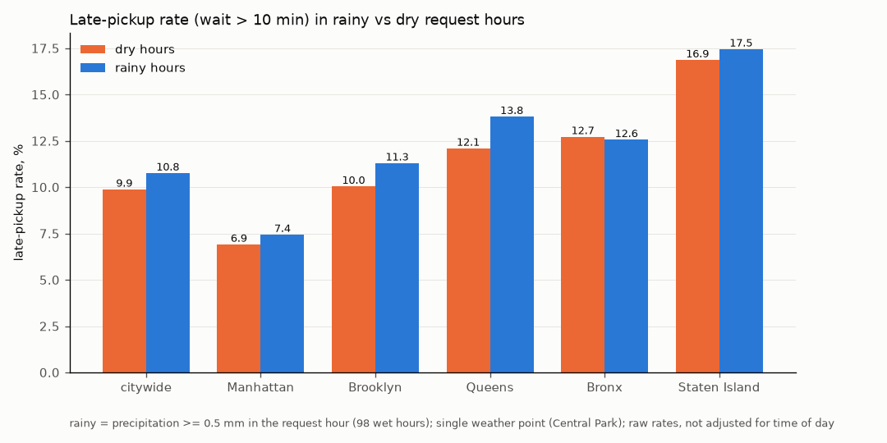

# Evidence: 2026-07

Scope: full month. Pipeline commit `86fcccfa0e51266088cedac63439389083fd8cbc`. Generated by `pipeline/report.py` from `metrics.csv` and `incentive_cells.csv`.

## Evidence table

| # | metric | value | n | data behind it |
|---|---|---|---|---|
| M1 (KPI) | Late-pickup rate, wait > 10 min | 10.02% | 20,554,133 | wait-eligible rows: 98.245% of rows in |
| M1 | Late-pickup rate, wait > 8 min | 17.53% | 20,554,133 | threshold sensitivity |
| M1 | Late-pickup rate, wait > 15 min | 2.69% | 20,554,133 | threshold sensitivity |
| M1 | Late rate > 10 min, if pre-arranged rides (R12) were counted | 9.92% | 20,920,873 | sensitivity of the exclusion |
| M1 | Late rate > 10 min, if whole-minute requests (R14) were dropped | 9.99% | 20,199,035 | sensitivity of the exclusion |
| M1 | Late rate > 10 min, Uber non-WAV | 11.30% | 14,904,334 | wait coverage 98.24% of this segment's clean rows |
| M1 | Late rate > 10 min, Uber WAV | 27.44% | 41,228 | wait coverage 94.62% of this segment's clean rows |
| M1 | Late rate > 10 min, Lyft non-WAV | 6.43% | 5,598,842 | wait coverage 98.53% of this segment's clean rows |
| M1 | Late rate > 10 min, Lyft WAV | 34.73% | 9,729 | wait coverage 41.98% of this segment's clean rows |
| M2 | p90 wait (minutes) | 10.02 | 20,554,133 | same rows as the KPI |
| M3 | Median on-scene dwell (minutes), Uber | 0.77 | 14,210,255 | dwell coverage 93.40% (on_scene < pickup) |
| M3 | Median on-scene dwell (minutes), Lyft | 0.77 | 5,697,636 | dwell coverage 99.86% (on_scene < pickup) |
| M4 | Rain minus dry late rate, rain >= 0.5 mm/h (raw) | +0.88 pts | 20,551,989 | wet hours: 98 of 744 hours |
| M4 | Rain minus dry, rain >= 0.5 mm/h, within hour of day | +1.08 pts | 2,997,272 | n = trips in rainy hours; controls for time of day |
| M4 | Rain minus dry late rate, rain >= 2.5 mm/h (raw) | +1.32 pts | 20,551,989 | wet hours: 32 of 744 hours |
| M4 | Rain minus dry, rain >= 2.5 mm/h, within hour of day | +1.54 pts | 989,507 | n = trips in rainy hours; controls for time of day |
| M5 | Trusted-row share (not quarantined) | 99.998% | 20,921,249 | share of rows in |
| M5 | Wait-eligible share (rows in the KPI) | 98.245% | 20,921,249 | share of rows in |
| M5 | Dwell coverage (on_scene < pickup) | 95.156% | 20,921,249 | share of rows in |

## Top 20 zone x hour-of-week cells for driver incentives

Ranked by **excess late trips** = (cell late rate - citywide late rate 10.02%) x n: how many more trips were late in that cell than if it matched the city. Cells need n >= 200 trips in the month; 28,360 cells qualify. Day and hour are of the request. Pickup zones 264/265 and pre-arranged rides are excluded.

| rank | borough | zone | day-hour (request) | late rate | vs city | n | excess late trips | p90 wait (min) |
|---|---|---|---|---|---|---|---|---|
| 1 | Queens | LaGuardia Airport | Wed 23:00 | 61.5% | +51.5 pts | 5,534 | 2850 | 19.9 |
| 2 | Queens | LaGuardia Airport | Mon 23:00 | 63.2% | +53.2 pts | 4,834 | 2573 | 20.6 |
| 3 | Queens | LaGuardia Airport | Tue 00:00 | 66.2% | +56.2 pts | 4,129 | 2319 | 23.0 |
| 4 | Queens | LaGuardia Airport | Thu 21:00 | 54.5% | +44.5 pts | 5,138 | 2284 | 20.1 |
| 5 | Queens | LaGuardia Airport | Thu 23:00 | 56.0% | +46.0 pts | 4,933 | 2269 | 18.6 |
| 6 | Queens | LaGuardia Airport | Sun 23:00 | 57.8% | +47.8 pts | 4,488 | 2143 | 18.3 |
| 7 | Queens | LaGuardia Airport | Wed 22:00 | 56.2% | +46.2 pts | 4,519 | 2088 | 18.5 |
| 8 | Queens | LaGuardia Airport | Fri 00:00 | 61.6% | +51.5 pts | 3,990 | 2056 | 18.8 |
| 9 | Queens | JFK Airport | Tue 00:00 | 59.2% | +49.2 pts | 4,000 | 1966 | 21.7 |
| 10 | Queens | LaGuardia Airport | Mon 22:00 | 54.1% | +44.1 pts | 4,366 | 1927 | 17.6 |
| 11 | Queens | LaGuardia Airport | Thu 22:00 | 54.5% | +44.5 pts | 4,309 | 1915 | 19.6 |
| 12 | Queens | LaGuardia Airport | Wed 21:00 | 47.8% | +37.7 pts | 4,645 | 1753 | 16.8 |
| 13 | Queens | LaGuardia Airport | Thu 00:00 | 61.2% | +51.2 pts | 3,348 | 1713 | 18.0 |
| 14 | Queens | JFK Airport | Sun 23:00 | 47.9% | +37.9 pts | 4,443 | 1682 | 17.4 |
| 15 | Queens | LaGuardia Airport | Sun 22:00 | 56.1% | +46.1 pts | 3,573 | 1647 | 18.9 |
| 16 | Queens | LaGuardia Airport | Sun 21:00 | 49.7% | +39.7 pts | 4,134 | 1642 | 16.4 |
| 17 | Queens | JFK Airport | Fri 00:00 | 51.2% | +41.2 pts | 3,960 | 1631 | 21.0 |
| 18 | Queens | LaGuardia Airport | Thu 20:00 | 43.0% | +33.0 pts | 4,940 | 1631 | 16.1 |
| 19 | Queens | LaGuardia Airport | Mon 21:00 | 50.6% | +40.6 pts | 3,731 | 1513 | 16.3 |
| 20 | Queens | LaGuardia Airport | Fri 23:00 | 45.7% | +35.7 pts | 4,201 | 1498 | 14.9 |

## Charts

## Known / Unknown / Assumption / Limitation

**Known**
- The TLC file is complete for the month: 20,921,249 rows; 31/31 days and 744/744 hours have pickups; bytes match Content-Length; TLC's aggregate report agrees within the sanity band.
- 99.998% of rows pass every REJECT rule; 98.245% enter the KPI.

**Unknown**
- Cancellations and unfulfilled requests are not in the data, so the KPI is conditional on a trip happening. True rider wait including cancellations cannot be known from this source.
- Which trips were booked in advance: the file has no scheduling field.

**Assumption**
- Late means wait > 10 min (observed p90), fixed across months; reported at 8 and 15 min too.
- Wait is measured from request, not on_scene. Where on_scene is before request (R12), the request is treated as a booking time, not the rider's ask, and the row leaves the KPI.
- One weather point (Central Park; its grid cell lies over New Jersey) stands for the whole city.
- on_scene is trusted where it is before pickup; where it equals pickup it was not captured.

**Limitation**
- One month (2026-07), which includes the July 4 holiday weekend; wet hours cluster on it.
- Weather is model reanalysis, not a station.
- Dwell coverage differs by company (Uber 93.40%), so dwell comparisons rest on different shares of trips.
- Lyft WAV: only 41.98% of clean trips can enter wait metrics, so the Lyft WAV late rate rests on a minority of that segment's trips.

## Definitions

- M1 late-pickup rate: share of wait-eligible clean trips with wait > 10 min (`avg(is_late_N)` over `model.fact_trip WHERE NOT flag_r12`).
- M2: `quantile_cont(wait_minutes, 0.9)` over the same rows.
- M3: `median(dwell_minutes)` where `NOT flag_r09 AND NOT flag_r13` (arrival captured).
- M4: late rate in rainy request hours minus dry ones; raw, and within hour of day.
- M5: trusted-row share, wait-eligible share and dwell coverage, all over rows in.
- SQL: `pipeline/sql/07_metrics.sql`, `pipeline/sql/08_incentive_cells.sql`.
