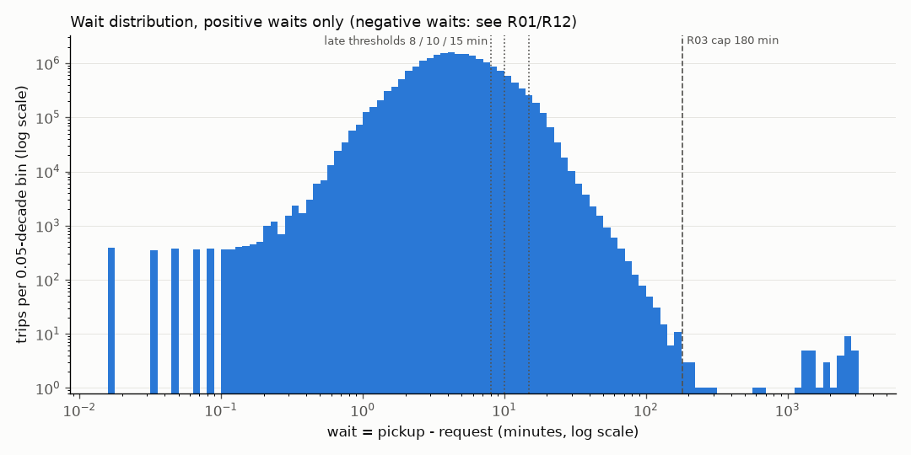

# Profile: 2026-07

Scope: full month: 20,921,249 rows. Generated by `pipeline/profile.py` from `pipeline/sql/03_profile.sql`.
Times are TLC's naive local timestamps. Durations in minutes unless the column says so.

## Charts

Timestamps have one-second resolution, so waits under ~0.1 min fall into separate 1 s / 2 s / 3 s bins (the spikes on the left). Empty bins are drawn empty.

## Wait minutes (pickup - request): percentiles, overall and by company

| company | n | p1 | p5 | p25 | p50 | p75 | p90 | p99 | p99_9 | max | min |
|---|---|---|---|---|---|---|---|---|---|---|---|
| ALL | 20,921,249 | -1.7 | 1.47 | 2.93 | 4.42 | 6.73 | 9.98 | 18.63 | 29.68 | 3057.2 | -136.5 |
| HV0003 | 15,215,374 | -1.17 | 1.4 | 2.85 | 4.35 | 6.92 | 10.47 | 19.17 | 30.3 | 217.4 | -70.5 |
| HV0005 | 5,705,875 | -3.32 | 1.63 | 3.17 | 4.55 | 6.4 | 8.77 | 16.23 | 27.87 | 3057.2 | -136.5 |

## Wait tail

| p99_99 | p99_999 | over_60 | over_120 | over_180 | over_180_lyft | over_300 | over_1000 |
|---|---|---|---|---|---|---|---|
| 52.3 | 91.7 | 1,164 | 87 | 44 | 41 | 37 | 34 |

## Negative wait and on_scene before request, by company x WAV

| company | wav_request | wav_match | n | negative_wait | pct_negative | on_scene_before_request | pct_on_scene_before_request | both_signals | median_negative_wait |
|---|---|---|---|---|---|---|---|---|---|
| HV0003 | N | N | 13,447,995 | 149,213 | 1.11 | 235,461 | 1.75 | 148,944 | -6.07 |
| HV0003 | N | Y | 1,723,806 | 21,262 | 1.23 | 31,696 | 1.84 | 21,240 | -6.43 |
| HV0003 | Y | Y | 43,573 | 1,561 | 3.58 | 2,345 | 5.38 | 1,561 | -7.02 |
| HV0005 | N | N | 5,360,580 | 58,571 | 1.09 | 79,428 | 1.48 | 58,571 | -6.5 |
| HV0005 | N | Y | 322,119 | 3,197 | 0.99 | 4,375 | 1.36 | 3,197 | -6.52 |
| HV0005 | Y | Y | 23,176 | 12,730 | 54.93 | 13,447 | 58.02 | 12,730 | -7.42 |

## Negative wait vs on_scene before request (overlap)

| negative_wait | on_scene_before_request | n |
|---|---|---|
| false | false | 20,554,206 |
| false | true | 120,509 |
| true | false | 291 |
| true | true | 246,243 |

## Do on_scene-before-request rows look like reservations?

| grp | n | pct_dropoff_airport | median_miles | median_dwell | pct_whole_minute_request |
|---|---|---|---|---|---|
| a negative wait + on_scene < request | 246,243 | 29.7 | 8.72 | 2.18 | 82.1 |
| b wait >= 0 + on_scene < request | 120,509 | 47.3 | 11.46 | 11.13 | 81.5 |
| c negative wait only | 291 | 10.3 | 10.08 | -11.48 | 1.4 |
| d other trips | 20,554,206 | 4.4 | 2.84 | 0.68 | 1.7 |

## Whole-minute request times by wait band (chance = 1.7%)

| company | wait_band | n | pct_whole_minute_request | pct_on_scene_before_request |
|---|---|---|---|---|
| HV0003 | a <0 | 172,036 | 98.3 | 99.8 |
| HV0003 | b 0-10 | 13,324,274 | 2.3 | 0.6 |
| HV0003 | c 10-20 | 1,598,483 | 2.3 | 0.5 |
| HV0003 | d 20-30 | 104,694 | 7 | 4 |
| HV0003 | e 30-60 | 14,908 | 34.4 | 24.2 |
| HV0003 | f 60-180 | 976 | 65.5 | 44.9 |
| HV0003 | g 180+ | 3 | 66.7 | 0 |
| HV0005 | a <0 | 74,498 | 44.3 | 100 |
| HV0005 | b 0-10 | 5,264,873 | 1.7 | 0.4 |
| HV0005 | c 10-20 | 342,589 | 1.8 | 0.2 |
| HV0005 | d 20-30 | 19,838 | 2.6 | 0.3 |
| HV0005 | e 30-60 | 3,892 | 3.6 | 0.5 |
| HV0005 | f 60-180 | 144 | 3.5 | 1.4 |
| HV0005 | g 180+ | 41 | 0 | 0 |

## Pre-arrangement signals by pickup hour

| pickup_hour | n | pct_on_scene_before_request | pct_negative_wait |
|---|---|---|---|
| 0 | 777,133 | 0.38 | 0.22 |
| 1 | 539,234 | 0.34 | 0.24 |
| 2 | 389,652 | 0.68 | 0.49 |
| 3 | 314,261 | 3.47 | 2.37 |
| 4 | 330,831 | 8.07 | 4.51 |
| 5 | 401,567 | 7.44 | 3.9 |
| 6 | 576,695 | 4.76 | 2.72 |
| 7 | 824,896 | 3.66 | 2.38 |
| 8 | 1,058,285 | 2.95 | 2.19 |
| 9 | 1,023,397 | 2.81 | 2.23 |
| 10 | 927,540 | 2.41 | 1.91 |
| 11 | 917,656 | 2.1 | 1.63 |
| 12 | 941,050 | 2.05 | 1.62 |
| 13 | 969,738 | 1.87 | 1.43 |
| 14 | 1,022,461 | 1.54 | 1.09 |
| 15 | 1,057,770 | 1.28 | 0.84 |
| 16 | 1,096,775 | 1.23 | 0.78 |
| 17 | 1,183,670 | 1.12 | 0.71 |
| 18 | 1,199,162 | 0.93 | 0.56 |
| 19 | 1,140,514 | 0.67 | 0.39 |
| 20 | 1,075,560 | 0.53 | 0.31 |
| 21 | 1,080,782 | 0.46 | 0.28 |
| 22 | 1,083,323 | 0.48 | 0.3 |
| 23 | 989,297 | 0.44 | 0.27 |

## on_scene vs pickup, by company

| company | n | pct_on_scene_null | pct_on_scene_eq_pickup | pct_on_scene_after_pickup | pct_dwell_measurable |
|---|---|---|---|---|---|
| HV0003 | 15,215,374 | 0 | 6.6 | 0.003 | 93.39 |
| HV0005 | 5,705,875 | 0 | 0.14 | 0 | 99.86 |

## Dwell minutes (pickup - on_scene) where on_scene < pickup

| company | n | p25 | p50 | p75 | p90 | p99 | max |
|---|---|---|---|---|---|---|---|
| HV0003 | 14,210,277 | 0.32 | 0.77 | 1.73 | 2.02 | 5.65 | 229.4 |
| HV0005 | 5,697,691 | 0.3 | 0.77 | 1.75 | 3.13 | 7.15 | 96.6 |

## Implied speed, mph (trip_miles / trip_time); trip_time = 0 -> NULL

| trip_time_zero | p50 | p90 | p99 | p99_9 | p99_99 | max | over_55 | over_65 | over_100 |
|---|---|---|---|---|---|---|---|---|---|
| 29 | 11.4 | 23.5 | 36.8 | 46.6 | 54 | 3,484 | 1,451 | 42 | 10 |

## Implied speed, 5-mph bins from 40 mph

| mph_bin_lo | n |
|---|---|
| 40 | 73,897 |
| 45 | 24,315 |
| 50 | 6,441 |
| 55 | 1,219 |
| 60 | 190 |
| 65 | 21 |
| 70 | 2 |
| 75 | 3 |
| 80 | 2 |
| 85 | 2 |
| 95 | 2 |

## Speed from timestamps instead of trip_time (why R06 uses trip_time)

| n_over_65_by_timestamps | median_timestamp_seconds | median_trip_time_seconds |
|---|---|---|
| 661 | 20 | 1,305 |

## trip_time vs dropoff - pickup (R07)

| gap_over_120s | pct_gap_over_120s | median_gap_seconds | p99_abs_gap_seconds |
|---|---|---|---|
| 323,291 | 1.545 | 0 | 161 |

## Duplicates: exact row and business key

| exact_duplicate_extra_rows | rows_in_exact_duplicate_groups | business_key_groups_with_collision | business_key_extra_rows | collision_groups_with_distinct_requests |
|---|---|---|---|---|
| 0 | 0 | 20 | 20 | 20 |

## Zero miles, negative pay/fare, unknown zones, out-of-period rows

| n | trip_miles_zero | miles_zero_time_over_60s | driver_pay_negative | fare_negative | pickup_zone_264 | pickup_zone_265 | pct_pickup_unknown | dropoff_zone_264_265 | dropoff_not_after_pickup | pickup_outside_month |
|---|---|---|---|---|---|---|---|---|---|---|
| 20,921,249 | 1,987 | 1,733 | 5 | 4,326 | 0 | 1,245 | 0.006 | 978,358 | 2 | 0 |

## Every column

| column_name | column_type | null_% | distinct | min | max | top_5_values |
|---|---|---|---|---|---|---|
| hvfhs_license_num | VARCHAR | 0 | 2 | HV0003 | HV0005 | HV0003 (15,215,374); HV0005 (5,705,875) |
| dispatching_base_num | VARCHAR | 0 | 2 | B03404 | B03406 | B03404 (15,215,374); B03406 (5,705,875) |
| originating_base_num | VARCHAR | 27.16 | 4 | B00887 | B03406 | B03404 (15,215,321); None (5,682,699); B03406 (23,176); B02026 (47); B00887 (6) |
| request_datetime | TIMESTAMP | 0 | 2,635,538 | 2026-06-29 14:40:33 | 2026-08-01 00:30:00 | 2026-07-22 09:10:00 (268); 2026-07-15 09:10:00 (261); 2026-07-13 09:10:00 (259); 2026-07-16 09:10:00 (257); 2026-07-30 09:10:00 (251) |
| on_scene_datetime | TIMESTAMP | 0 | 2,640,149 | 2026-06-30 23:09:00 | 2026-07-31 23:59:58 | 2026-07-15 17:46:45 (34); 2026-07-18 19:25:03 (33); 2026-07-15 17:47:07 (32); 2026-07-15 17:47:15 (32); 2026-07-15 17:47:55 (32) |
| pickup_datetime | TIMESTAMP | 0 | 2,639,717 | 2026-07-01 00:00:00 | 2026-07-31 23:59:59 | 2026-07-01 19:16:33 (32); 2026-07-18 11:57:13 (32); 2026-07-31 19:48:22 (32); 2026-07-03 20:23:38 (31); 2026-07-15 17:47:34 (31) |
| dropoff_datetime | TIMESTAMP | 0 | 2,641,314 | 2026-07-01 00:02:11 | 2026-08-01 02:04:28 | 2026-07-18 20:26:16 (33); 2026-07-31 19:13:17 (32); 2026-07-18 19:54:47 (31); 2026-07-10 08:59:24 (30); 2026-07-16 17:43:59 (30) |
| PULocationID | INTEGER | 0 | 262 | 1 | 265 | 138 (415,137); 132 (373,091); 61 (275,619); 230 (262,888); 76 (248,743) |
| DOLocationID | INTEGER | 0 | 262 | 1 | 265 | 265 (977,728); 138 (450,645); 132 (428,629); 61 (288,056); 76 (247,028) |
| trip_miles | DOUBLE | 0 | 59,822 | 0.0 | 1431.47 | 1.14 (44,371); 1.15 (44,126); 1.13 (43,981); 1.12 (43,903); 1.25 (43,870) |
| trip_time | BIGINT | 0 | 11,791 | 0 | 49332 | 549 (16,103); 531 (16,081); 558 (16,066); 565 (16,035); 587 (16,031) |
| base_passenger_fare | DOUBLE | 0 | 38,984 | -225.21 | 1418.32 | 8.94 (84,822); 8.95 (62,767); 8.04 (60,549); 8.93 (59,850); 8.03 (59,501) |
| tolls | DOUBLE | 0 | 2,000 | 0.0 | 136.31 | 0.0 (18,600,358); 7.46 (1,518,396); 16.79 (344,882); 14.79 (89,641); 3.42 (71,055) |
| bcf | DOUBLE | 0 | 2,041 | 0.0 | 37.29 | 0.22 (555,454); 0.27 (511,393); 0.2 (504,488); 0.29 (498,722); 0.31 (452,472) |
| sales_tax | DOUBLE | 0 | 4,843 | 0.0 | 119.34 | 0.0 (730,242); 0.71 (345,136); 0.95 (338,946); 0.87 (312,853); 0.79 (294,293) |
| congestion_surcharge | DOUBLE | 0 | 4 | 0.0 | 2.75 | 0.0 (13,755,225); 2.75 (7,069,307); 0.75 (96,713); 1.5 (4) |
| airport_fee | DOUBLE | 0 | 25 | 0.0 | 9.0 | 0.0 (19,141,848); 3.5 (1,733,045); 1.75 (31,288); 7.0 (12,345); 4.0 (1,695) |
| tips | DOUBLE | 0 | 7,461 | 0.0 | 307.39 | 0.0 (16,861,661); 3.0 (480,049); 1.0 (353,017); 5.0 (288,183); 2.0 (187,078) |
| driver_pay | DOUBLE | 0 | 28,886 | -18.2 | 1199.35 | 4.0 (575,350); 6.48 (73,013); 6.4 (34,355); 6.8 (28,496); 10.61 (27,145) |
| shared_request_flag | VARCHAR | 0 | 2 | N | Y | N (20,631,799); Y (289,450) |
| shared_match_flag | VARCHAR | 0 | 2 | N | Y | N (20,755,436); Y (165,813) |
| access_a_ride_flag | VARCHAR | 0 | 2 | N | Y | N (20,901,665); Y (19,584) |
| wav_request_flag | VARCHAR | 0 | 2 | N | Y | N (20,854,500); Y (66,749) |
| wav_match_flag | VARCHAR | 0 | 2 | N | Y | N (18,808,575); Y (2,112,674) |
| cbd_congestion_fee | DOUBLE | 0 | 3 | 0.0 | 3.0 | 0.0 (14,088,641); 1.5 (6,832,600); 3.0 (8) |
